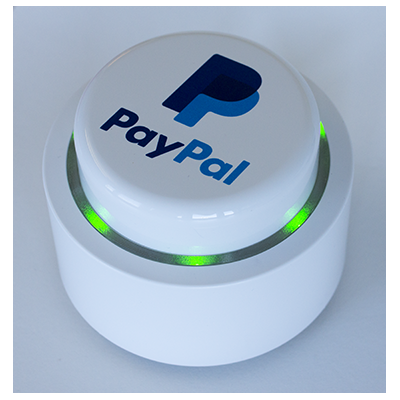
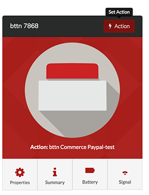
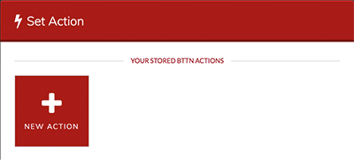
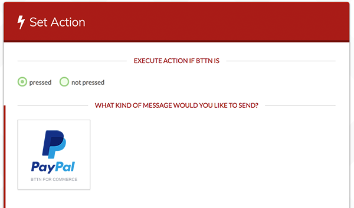
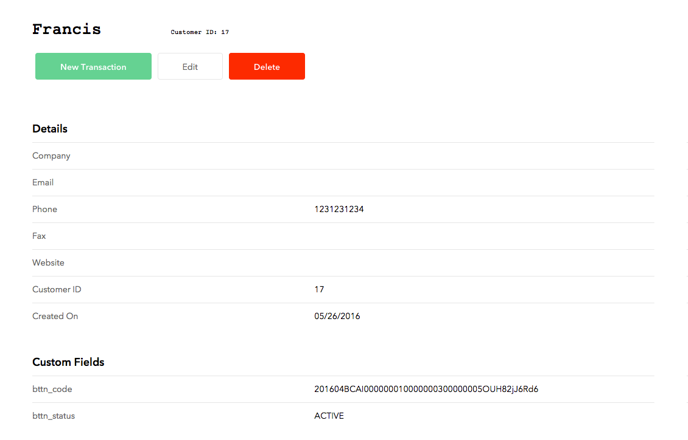

[](https://heroku.com/deploy)

# PayPal bt.tn
Demo site for PayPal/bt.tn: https://ppbttn.herokuapp.com/

## bt.tn
1. [Purchase a bttn](https://bt.tn/shop/) and fill out [this form](https://docs.google.com/forms/d/e/1FAIpQLSduzTRXBxVta8gstoG37mIWVPyL7sXdbDso3jxPpJZrYOFUJQ/viewform) to enable the beta PayPal integration.  You will receive an email from bttn with your `BTTN_API_KEY` and `BTTN_API_MERCHANT_NAME`. Update `config.php` with these details.
1. When you receive your button, [register it](https://my.bt.tn/register).
2. [Login](https://my.bt.tn/) and select *action* for your bttn.

 
 
3. Select *new action*.

  

4. Select "pressed" for "EXECUTE ACTION IF BTTN IS".
5. Select "PayPal bttn for commerce" as the action.

  

6. Select the "save" button.


# Braintree
## API keys
Update `config.php` with your Braintree API details
```
Braintree_Configuration::environment('sandbox');
Braintree_Configuration::merchantId('');
Braintree_Configuration::publicKey('');
Braintree_Configuration::privateKey('');
```

## Custom Fields
You will need to setup the following [`customFields`](https://articles.braintreepayments.com/control-panel/custom-fields):

1. `bttn_status` - One of ACTIVE (button has been fully registered and is ready for use), ONBOARDED (user has requested to be sent a button), UNREGISTERED (user once had a button, but is no longer associated to one).

2. `bttn_code` - The code of the button associated to the user.




# Setup
## MySQL Database
We specifically wrote our code to not need a database, but you will get some functionality and additional performance improvements if you use one.

Set `$settings["USE_DATABASE"] = true;`

Update `config.php` with your database connection details.
```
DB::$user = 'button';
DB::$password = 'button1';
DB::$dbName = 'button';
DB::$host = '127.0.0.1';
```

## Email
Update `config.php` with your email settings.
```
$settings["MAIL_SMTP_HOST"] = "some.smtp.server";
$settings["MAIL_SMTP_PORT"] = 587;
$settings["MAIL_FROM_NAME"] = "William's Widgets";
$settings["MAIL_FROM_EMAIL"] = "noreply@someone.com";
$settings["MAIL_BCC"] = "informational_bcc@someone.com";
```
